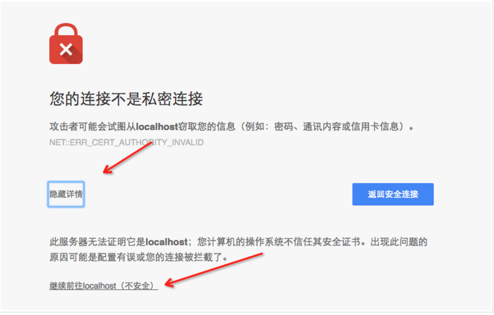
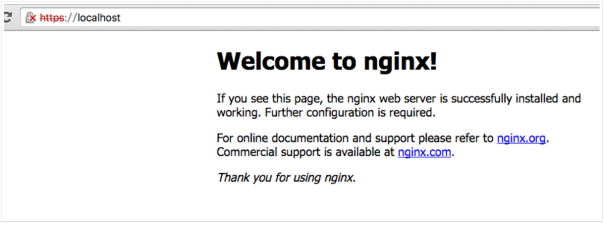
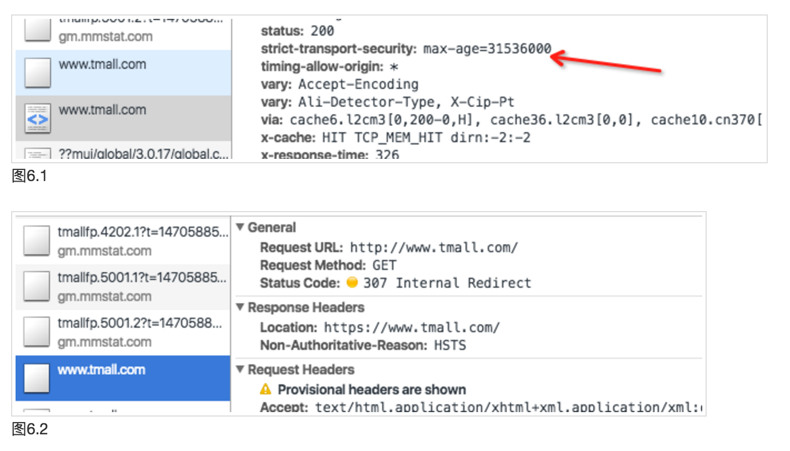

## 了解HTTPS

本篇只是聊一聊HTTPS那些事儿，且不说底层实现(想深入学习的同学可以自行百度)。

## 1. 什么是https
https是http的加密版本，是在http请求的基础上，采用ssl(Secure Sockets Layer)进行加密传输。
咱们平时的http请求是明文传输，也就是说，如果经过电信运营商(电信、移动等，或者方正等)，
传输过程中，信息是可以被截获的(网站的form表单、html等)。有些运营商甚至会劫持你的网站(稍后详细讲解)。
那么网页如果进行了加密，在客户端与服务端的传输过程中，咱们的https请求内容即使被截获了，
也无法读取其内容，或者加入一些劫持者想要的效果。
笔者认为，如果网站有涉及到一些私密信息，或者网站本身的流量比较大，可以产生一些经济价值的话，都尽量使用https进行传输。

## 2. 做什么用呢？
#### 2.1 加密数据
你的网站如果有登录这种东西的话建议尽量使用https做，这样可以保证用户名、密码不被截获。
咱们平时使用的post请求中所带的用户名密码等，非常容易被获取到。
这点正如你小时候写小纸条的时候，让同学传递显然不安全，谁知道纸条传到前排同学之前，会不会被老师拦截呢。
很多大网站均已采用了https，比如，一号店网站的首页，虽然是http协议的，但是登录的页面，
使用的却是https协议。

#### 2.2 反劫持
劫持这种东西，最典型的例子，应该就是，有的时候手机上浏览网站的时候，会有小圆球提醒你流量已经用了百分之多少了。
如果猜的没错的话，应该是移动运营商劫持了网页，并将流量提醒插在这些网页中的。
这点也正如，你传了个小纸条给同学，中间说不准就被谁把原话给改掉了。

别以为劫持只是在你的网页里面插一些小广告，既然连广告都插得了，插一些js把你的cookie传到自己服务器上，也不是什么难事儿。
亦或者做个钓鱼网页，让用户输入用户名和密码，也是非常容易的。所以，劫持是一件非常恐怖的事情。
我们使用了https进行加密的话，则可以在大部分情况下规避这种危害。
https加密后，中间商们无法再随意向加过密的html内容中插入的自己的代码了。

#### 2.3 SEO
其实谷歌对于https的网站，搜索结果会给予更高的排名。
国内的话，主要还是使用百度搜索引擎，但是百度搜索引擎目前只收录少部分的https网页，目前百度不主动抓取https页面。
所以，如果是国内网站需要做seo的话，建议每张网页都提供http/https两种版本的访问方式。
或者主页面、需要被抓取的页面使用http方式，而登录等功能采用https方式(就像一号店，或者京东)，
如我们在百度中搜索京东商城，其实点击进入的是京东的http版本。
其实，京东是提供https访问的，这里怀疑与seo有关。

## 3. 如何开启https
这里，我们使用nginx来简单的了解一下https的使用方式。
由于我们是在本地实验，所以可以先使用一个本地生成的证书进行实验。

#### 3.1 生成私钥与证书
首先进入一个生成证书的目录下(自己随便建一个就好)，你需要执行一下命令
(如果接下来，没有权限的话，server.key: Permission denied则加上sodu就好了)
执行下面的命令，并按照提示，输入口令，接下来，凡是提示需要输入口令的地方，都需要输入这个口令：
```
openssl genrsa -des3 -out server.key 1024
openssl req -new -key server.key -out server.csr
openssl rsa -in server.key -out server.key.out
```
标记私钥与证书
```
penssl x509 -req -days 365 -in server.csr -signkey server.key.out -out server.crt
```

#### 3.2 配置nginx
如下所示，配置nginx，ssl_certificate的路径，写成刚刚生成证书的路径即可，
ssl_certificate_key也写为刚刚生成私钥的路径即可。


#### 3.3 重启nginx，查看效果
访问https://localhost时，可能会弹出这种警告(如图3.3.1)，或者这种警告(如图3.3.2)，直接继续就好，
这是因为咱们的证书是自己手动生成的。接下来就能看到效果了(如图3.3.3)。
图3.3.1)


图3.3.2


图3.3.3


如果想接下来不弹出这种警告，就要在浏览器中安装自己生成的证书了。
浏览器安装证书，步骤如下，想了解的同学自行百度一下"chrome导入https证书"，把自己的证书crt文件导入即可。
使用其他类型的server的同学，可以自己查一下，如何配置server的https服务。
还有，需要做线上服务的同学，尽量使用证书机构颁发的证书，(现在有很多免费的证书)，这样不会给用户弹出一些奇怪的界面。

## 4. 网站如何适配？
如果我们想要将自己的网站https化，那么其中的资源肯定是需要均为https协议传输的。
否则，如果一个https的网站，使用了http的资源的话，那么这个资源被劫持，整个网站也相当于被劫持了。
这就没有意义了。而且，很多http的资源在https的环境下，浏览器甚至都不让其加载。
接下来我们就来盘点一下https的网站中引入的资源的一些问题。

#### 4.1 http资源无法加载
在https环境下，http协议的js/css/请求/iframe等资源是根本加载不进来的(如图4.1.1)。
图4.1.1


所以，如果想要使用这些资源的话，需要把访问这些资源的方式，转换为https，稍后会说道如何解决。
我们称这种https页面中引用http资源的方式为"mix content"

#### 4.2 图片/视频/音频的特殊性
为什么要单独拿出这些资源说一下呢，在w3c的规范中，这些资源本应该也和其他静态资源一样---https的环境下，
引用http的图片是会被阻止掉的。笔者在去年实践的时候，chrome等主流浏览器还是会阻止这些http资源的加载的。
也就是说，https的页面引用http的图片的话，图会裂掉。

可是，新版的chrome并没有按照规范去做。而是在https的环境下，依然可以加载并展示http的图片/视频/音频等资源。
这是因为，其实很多目前互联网上的很多网站，还是比较混乱的，为了保证整个互联网的用户体验，chrome等浏览器，
对于这种加载还是进行了宽容对待。可是，就算是这样，也不代表我们应该再https的页面中加载http的资源，
毕竟，这样会失去我们最初https加密的意义，安全的网页上加载了不安全的资源，整个网页还是不安全的。
所以笔者建议，即使加载http的图片资源可以展示，还是规范读者们不要这样做。

#### 4.3 如何解决混合资源加载问题
###### 1 动态判断与协议相对URL

比如京东商城，在访问http://www.jd.com的时候，css是使用http协议加载的,
在使用https://www.jd.com的时候，静态资源均变成了相应域名的https地址.
笔者更建议的是，如果自己的静态服务器，两种协议均支持(即http://xxx.com/a.js与https://xxx.com/a.js均可支持访问)的话，
则直接在引用资源的时候，去掉协议头，改为相对协议，如`//xxx.com/a.js`。
这样，请求a.js这个资源的时候，浏览器会按照当前页面的协议，进行请求，这叫做-----"协议相对地址"

比如京东商城中的一个js资源(如图4.3.3)，写的便是协议相对地址：
再http的环境下，请求的便是以http为开头的此资源。在https的环境下，请求的便是https为开头的此资源.

###### 2 自己做个https代理
如果自己的资源服务，不支持https访问的话，我们可以采用代理的方式，来引入这些文件。
最简单的方式就是使用nginx，将引入的静态文件均做个代理。
也就是说，访问资源的时候，用的是咱们的代理地址，但是拿文件的时候，还是会去http的源地址去拿的。

## 5. 速度影响
使用https对网站传输进行加密，虽然有很多好处，但是也有弊端，那就是

#### 5.1 加密/解密的过程是需要消耗时间的
毕竟需要对传输的数据进行加密/解密，算法耗时是肯定有的。

#### 5.2 交换公钥/私钥消耗时间
https传输在传输之前是需要再服务端与客户端交换公钥/私钥的，这个过程也是非常耗时的。
有统计称https的链接耗时是http的连接耗时的3倍。

#### 5.3 跳转消耗时间
这里还有一个影响速度的点，那就是用户在浏览器中输入网址的时候，是不会去自己输入https协议头的，
如果你在浏览器中输入www.jd.com的话，默认浏览器访问的是http://www.jd.com的，
如果我们想要用户访问https的网站的话，就要自己进行一次网页重定向，重定向也是比较耗时的操作。
这都会对我们的网站速度造成影响。

## 6. HSTS
在第5节中，我们提到了，如果用户在浏览器端，输入www.jd.com实际上，
浏览器会默认将这个网址补全为http://www.jd.com而不是https://www.jd.com。
于是乎，我们如果想让用户访问我们的https版本网站，还得将页面强行重定向(跳转)一下。
这是一个比较耗时的操作。而且有些时候，还没等我们重定向网页呢，就被运营商给劫持了。
于是，接下来也跳不了了。怎么办？能不能在用户输入www.jd.com的时候，直接就访问到https://www.jd.com呢？
当然可以，我们需要介绍一下我们的新武器了-------HSTS。

其实hsts的做法比较简单，只要在用户访问网站的时候，响应头中加入Strict-Transport-Security这个头，
浏览器接下来的访问就均会默认采用https的方式进行访问了。
我们看到天猫在网站中加入了这个头部(如图6.1)，我们下次直接输入网址http://www.tmall.com的时候，
就可以看到，浏览器提前做了浏览器的内部跳转，如图6.2



建议使用https的站长们都加上这个头部，即提升了网站速度，又提高了网站的安全性。何乐而不为呢。