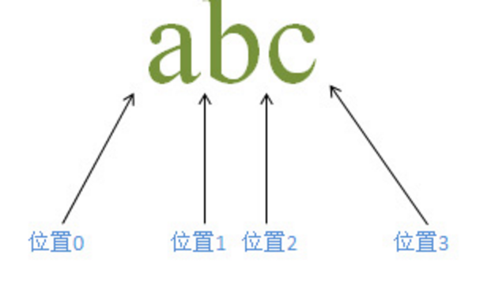
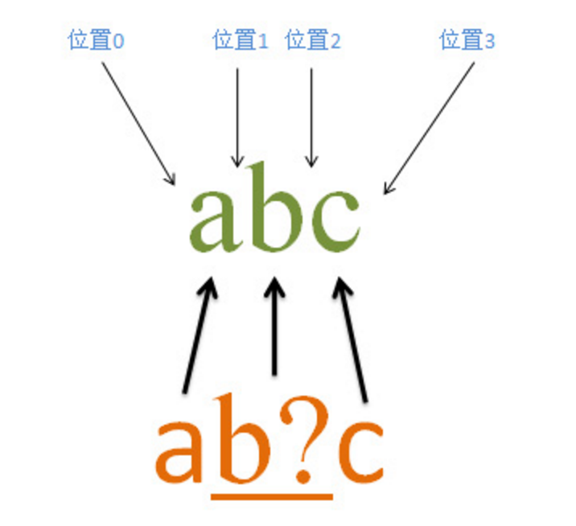
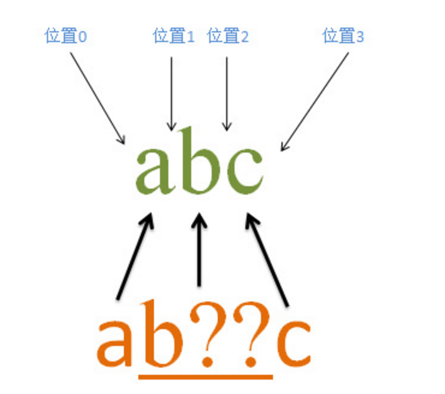

## 占有字符和零宽度

     在正则表达式匹配的过程中，如果子表达式匹配到的是字符内容，而非位置的话，
     并被保存在匹配的结果当中，那么就认为该子表达式是占有字符的；
     如果子表达式匹配的仅仅是位置，或者说匹配中的内容不保存到匹配的结果当中，那么就认为该子表达式是零宽度的。

我们先理解下匹配过程如下图：



正则匹配方式 /abc/ 
```
匹配过程：
首先由字符a取得控制权，从位置0开始进行匹配，a匹配a,匹配成功；
接着往下匹配，把控制权交给b，那么现在从位置1开始，往下匹配，匹配到字符串b，匹配成功，
接着继续往下匹配，位置是从2开始，把控制权交给c，继续往下匹配，匹配到字符串c，匹配成功，
所以整个表达式匹配成功；匹配结果为 abc 匹配的开始位置为0，结束位置为3；
```

含有匹配优先量词的匹配过程
如下：


```
源字符串abc，正则表达式为ab?c ；量词?可以理解为匹配优先量词，在可匹配可不匹配的时候，会优先选择匹配；
当匹配不到的时候，再进行不匹配。先匹配b是否存在，如果不存在的话，就不匹配b；
因此结果可以匹配的有 abc，ac等
```

匹配过程：
```
首先由字符a取得控制权，从位置0开始匹配，a匹配到字符串a，匹配成功；
接着继续匹配，把控制权交给b，b现在就从位置1开始匹配；匹配到字符串b，匹配成功；
接着就把控制权交给c，c从位置2开始继续匹配，匹配字符串c，匹配成功；
整个表达式匹配成功；假如b那会儿匹配不成功的话，它会忽略b，继续匹配字符串c，也就是如果匹配成功的话，结果是ac；

因此abc匹配字符串abc，匹配的位置从0开始，到3结束。

如果匹配的结果为ac的话，那么匹配的位置从0开始，到2结束；

假如我们把字符串改为abd，或者abe等其他的，那么当匹配到最后一个字符的时候，就匹配失败；
```

含有忽略优先量词的匹配过程


```
量词?? 含义是 忽略优先量词，在可匹配和可不匹配的时候，会选择不匹配，
这里的量词是修饰b字符的，所以b?? 是一个整体的。
```

匹配过程如下
```
首先由字符a取得控制权，从位置0开始匹配，有”a”匹配a，匹配成功，控制权交给b?? ;
首先先不匹配b，控制权交给c，由c来匹配b，匹配失败，此时会进行回溯，由b??来进行匹配b，匹配成功，
然后会再把控制权交给c，c匹配c，匹配成功，因此整个表达式都匹配成功；
```